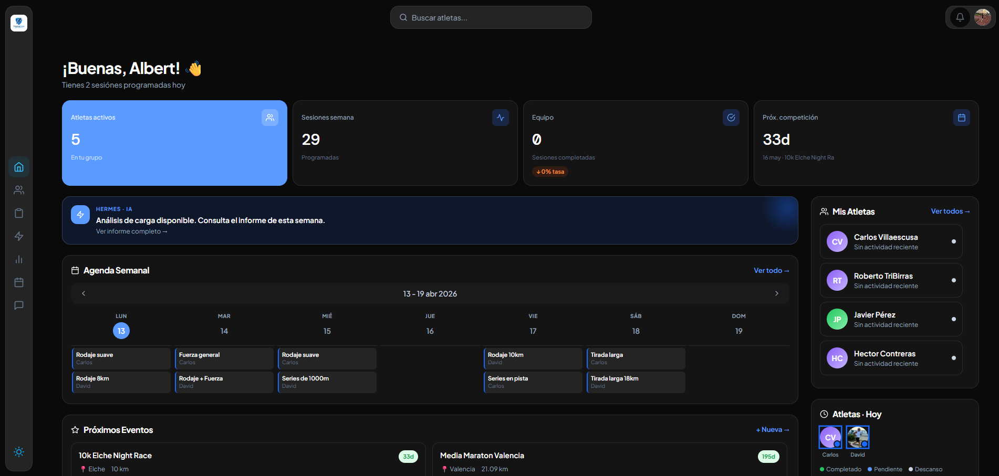
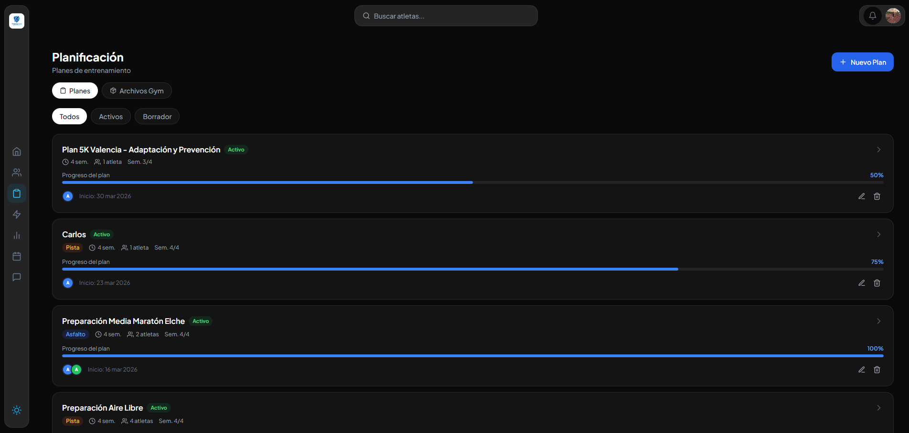
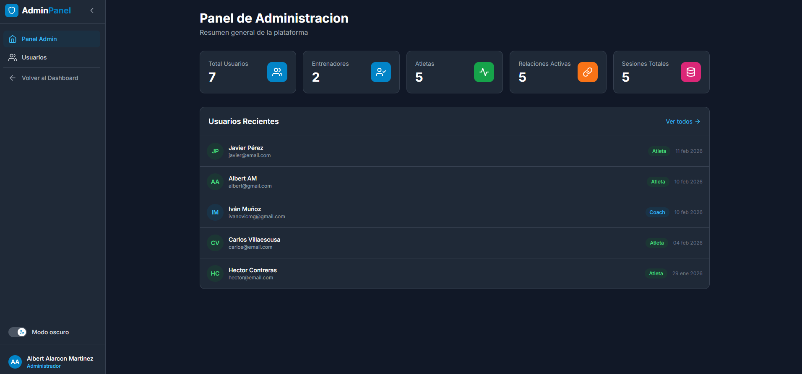

# TrainingTrack Pro

<div align="center">


**Plataforma integral de entrenamiento deportivo para entrenadores y atletas**

[](https://reactjs.org/)
[](https://vitejs.dev/)
[](https://supabase.com/)
[](https://tailwindcss.com/)
[]()

[Demo](https://trainingtrackpro.com) · [Documentación](#documentación) · [Reportar Bug](https://github.com/yourusername/trainingtrack/issues)

</div>

---

## 📋 Tabla de Contenidos

- [Características](#-características)
- [Tecnologías](#-tecnologías)
- [Arquitectura](#-arquitectura)
- [Instalación](#-instalación)
- [Configuración](#-configuración)
- [Desarrollo](#-desarrollo)
- [Build & Deploy](#-build--deploy)
- [Testing](#-testing)
- [Estructura del Proyecto](#-estructura-del-proyecto)
- [Casos de Uso](#-casos-de-uso)
- [Contribuir](#-contribuir)
- [Licencia](#-licencia)

---

## 🚀 Características

### Para Entrenadores (Coaches)

- **Gestión de Atletas**: Panel completo para administrar múltiples atletas
- **Planificación de Entrenamientos**: Creación y asignación de sesiones de entrenamiento semanales
- **Banco de Ejercicios**: Biblioteca personalizable de ejercicios de carrera y gimnasio
- **Seguimiento de Competiciones**: Registro y seguimiento de carreras y eventos
- **Sistema de Mensajería**: Comunicación directa con atletas
- **Estadísticas y Métricas**: Visualización de datos de rendimiento con gráficos interactivos
- **Informes con IA**: Generación automática de informes de rendimiento usando inteligencia artificial
- **Gestión de Suscripciones**: Sistema de planes (Free, Pro, Elite) con límites personalizables

### Para Atletas

- **Dashboard Personalizado**: Vista general de entrenamientos, competiciones y mensajes
- **Planificación Semanal**: Acceso a entrenamientos asignados por el coach
- **Registro de Competiciones**: Seguimiento de carreras pasadas y futuras
- **Visualización de Métricas**: Gráficos de progreso y estadísticas personales
- **Mensajería**: Comunicación directa con el coach
- **Perfil Personalizado**: Gestión de datos personales y configuración

### Panel de Administración

- **Gestión de Usuarios**: Control total sobre usuarios, coaches y atletas
- **Activación/Desactivación de Cuentas**: Revocación temporal o permanente de accesos
- **Gestión de Suscripciones**: Modificación de planes y límites por coach
- **Estadísticas Globales**: Métricas de uso de la plataforma
- **Sistema de Permisos**: Control granular de accesos mediante RLS policies


---

## 🛠 Tecnologías

### Frontend

- **[React 19.2.0](https://reactjs.org/)** - Biblioteca de UI con Hooks y Context API
- **[Vite 7.2.4](https://vitejs.dev/)** - Build tool ultra-rápido con HMR
- **[React Router 7.13](https://reactrouter.com/)** - Enrutamiento declarativo SPA
- **[Tailwind CSS 3.4](https://tailwindcss.com/)** - Framework CSS utility-first
- **[Framer Motion 12.29.2](https://www.framer.com/motion/)** - Animaciones declarativas
- **[Chart.js 5.3.1](https://www.chartjs.org/)** + **react-chartjs-2** - Gráficos interactivos
- **[React Icons](https://react-icons.github.io/react-icons/)** - Iconografía (Feather Icons)
- **[React Toastify](https://fkhadra.github.io/react-toastify/)** - Notificaciones toast

### Backend

- **[Supabase](https://supabase.com/)** - Backend-as-a-Service (PostgreSQL, Auth, Storage, Edge Functions)
- **[PostgreSQL](https://www.postgresql.org/)** - Base de datos relacional
- **[Row Level Security (RLS)](https://supabase.com/docs/guides/auth/row-level-security)** - Seguridad granular a nivel de fila
- **[Supabase Edge Functions](https://supabase.com/docs/guides/functions)** - Funciones serverless en Deno
- **[DeepSeek API](https://www.deepseek.com/)** - IA para generación de informes

### Herramientas de Desarrollo

- **[ESLint](https://eslint.org/)** - Linter de JavaScript/React
- **[PostCSS](https://postcss.org/)** - Transformación de CSS
- **[Autoprefixer](https://github.com/postcss/autoprefixer)** - Prefijos CSS automáticos

---

## 🏗 Arquitectura

### Estructura General

```
TrainingTrack Pro
├── Frontend (React + Vite)
│   ├── SPA con React Router
│   ├── Autenticación con Supabase Auth
│   ├── Estado global con Context API
│   └── Comunicación con Supabase Client
│
├── Backend (Supabase)
│   ├── PostgreSQL Database
│   │   ├── Tablas relacionales
│   │   ├── RLS Policies (seguridad)
│   │   └── Funciones SECURITY DEFINER
│   │
│   ├── Edge Functions (Deno)
│   │   └── generate-performance-report (IA)
│   │
│   └── Supabase Auth
│       ├── Email/Password
│       └── User metadata
│
└── Servicios Externos
    └── DeepSeek API (Informes IA)
```

### Flujo de Autenticación

1. Usuario se registra/inicia sesión con Supabase Auth
2. Se crea registro en tabla `users` con role (`coach` o `athlete`)
3. AuthContext carga perfil y valida estado (`is_active`, `is_admin`)
4. Layout Guards protegen rutas según el role
5. RLS Policies validan permisos en cada query

```
┌─────────────┐
│   Usuario   │
└──────┬──────┘
       │ Login/Register
       ↓
┌─────────────────┐
│ Supabase Auth   │
└────────┬────────┘
         │ Session Token
         ↓
┌─────────────────┐
│  AuthContext    │ ← Carga perfil desde users
└────────┬────────┘
         │
    ┌────┴────┐
    ↓         ↓
┌────────┐ ┌────────┐
│ Coach  │ │ Athlete│
│ Layout │ │ Layout │
└────────┘ └────────┘
```


### Base de Datos (Supabase)

#### Tablas Principales

- **users**: Usuarios base (id, email, role, is_admin, is_active)
- **coaches**: Datos de entrenadores (subscription_plan, max_athletes)
- **athletes**: Datos de atletas (birth_date, gender, running_profile)
- **coach_athlete_relationship**: Relación N:N entre coaches y atletas
- **training_sessions**: Sesiones de entrenamiento semanales
- **training_session_exercises**: Ejercicios dentro de sesiones
- **athlete_competitions**: Competiciones/carreras
- **running_exercises_bank** / **gym_exercises_bank**: Bibliotecas de ejercicios
- **coach_messages** / **athlete_messages**: Sistema de mensajería

#### Diagrama Entidad-Relación


### RLS Policies (Row Level Security)

Todas las tablas tienen políticas RLS que validan:
- `(select auth.uid())` para performance (no `auth.uid()` directo)
- Acceso basado en `role` del usuario
- Relación coach-atleta a través de `coach_athlete_relationship`
- Permisos de admin mediante `public.is_admin()` SECURITY DEFINER function

Ejemplo (tabla `training_sessions`):

```sql
-- Coach puede ver sus propias sesiones
CREATE POLICY "coach_select_own" ON training_sessions
FOR SELECT TO authenticated
USING (
  coach_id = (select auth.uid())
  OR public.is_admin()
);

-- Atleta puede ver sesiones que le asignaron
CREATE POLICY "athlete_select_assigned" ON training_sessions
FOR SELECT TO authenticated
USING (
  athlete_id = (select auth.uid())
  OR public.is_admin()
);
```

---

## 📦 Instalación

### Requisitos Previos

- **Node.js** >= 18.0.0
- **npm** >= 9.0.0 (o **pnpm** / **yarn**)
- Cuenta en **[Supabase](https://supabase.com/)** (free tier funciona)
- (Opcional) **DeepSeek API Key** para informes IA

### Clonar el Repositorio

```bash
git clone https://github.com/yourusername/trainingtrack-pro.git
cd trainingtrack-pro/Frontend
```

### Instalar Dependencias

```bash
npm install
```

---

## ⚙️ Configuración

### 1. Variables de Entorno

Crea un archivo `.env` en la raíz de `Frontend/`:

```env
# Supabase
VITE_SUPABASE_URL=https://your-project.supabase.co
VITE_SUPABASE_ANON_KEY=your-anon-key-here

# (Opcional) Analytics
VITE_GA_TRACKING_ID=G-XXXXXXXXXX
```

⚠️ **Importante**: Nunca commitees el archivo `.env` a git. Está incluido en `.gitignore`.

### 2. Configurar Supabase

#### a) Crear proyecto en Supabase

1. Ve a [supabase.com](https://supabase.com/) y crea un nuevo proyecto
2. Copia la **URL** y **anon key** desde Settings → API
3. Pégalas en tu archivo `.env`

#### b) Ejecutar migraciones

Las migraciones SQL están en `/supabase/migrations/` (si aplica). Ejecuta desde el Dashboard de Supabase:

- SQL Editor → Pega cada migración en orden
- O usa Supabase CLI:

```bash
npx supabase db push
```

#### c) Configurar Edge Function (Informes IA)

1. En Supabase Dashboard → Edge Functions
2. Despliega la función `generate-performance-report`
3. Añade el secret `DEEPSEEK_API_KEY` en Settings → Edge Functions → Secrets

```bash
# Desde Supabase CLI
supabase secrets set DEEPSEEK_API_KEY=sk-your-deepseek-key
```

### 3. Datos de Prueba (Opcional)

Para desarrollo local, puedes crear usuarios de prueba:

```sql
-- Crear coach de prueba
INSERT INTO users (id, email, role, is_active)
VALUES ('uuid-coach', 'coach@test.com', 'coach', true);

INSERT INTO coaches (id, subscription_plan, max_athletes)
VALUES ('uuid-coach', 'pro', 10);

-- Crear atleta de prueba
INSERT INTO users (id, email, role, is_active)
VALUES ('uuid-athlete', 'athlete@test.com', 'athlete', true);

INSERT INTO athletes (id, birth_date, gender)
VALUES ('uuid-athlete', '1995-05-15', 'male');

-- Relacionarlos
INSERT INTO coach_athlete_relationship (coach_id, athlete_id)
VALUES ('uuid-coach', 'uuid-athlete');
```

---

## 💻 Desarrollo

### Iniciar servidor de desarrollo

```bash
npm run dev
```

La app estará disponible en `http://localhost:5173`

### Comandos Disponibles

| Comando | Descripción |
|---------|-------------|
| `npm run dev` | Inicia servidor de desarrollo con HMR |
| `npm run build` | Build de producción en `/dist` |
| `npm run preview` | Preview del build de producción |
| `npm run lint` | Ejecuta ESLint en todo el código |

### Estructura de Rutas

```
/ (Landing Page pública)
│
├── /login (Login público)
├── /register (Registro público)
├── /forgot-password (Recuperación de contraseña)
│
├── /dashboard (Coach Layout - Protegido) ← CoachLayout.jsx
│   ├── /dashboard (Calendar view)
│   ├── /dashboard/atletas (Lista de atletas)
│   ├── /dashboard/atletas/:id (Perfil de atleta)
│   ├── /dashboard/metricas (Estadísticas coach)
│   └── /dashboard/mensajes (Mensajes)
│
├── /athlete (Athlete Layout - Protegido) ← AthleteLayout.jsx
│   ├── /athlete/dashboard (Dashboard atleta)
│   ├── /athlete/training (Entrenamientos)
│   ├── /athlete/metrics (Métricas atleta)
│   └── /athlete/messages (Mensajes)
│
└── /admin (Admin Layout - Protegido) ← AdminLayout.jsx
    ├── /admin (Panel admin)
    ├── /admin/users (Lista usuarios)
    ├── /admin/users/:id (Detalle usuario)
    └── /admin/login (Login admin separado)
```

### Contextos Globales

#### AuthContext

Gestiona autenticación y perfil del usuario.

```jsx
import { useAuth } from './contexts/AuthContext';

function MyComponent() {
  const { user, profile, signOut, isAdmin } = useAuth();

  // user: Objeto de Supabase Auth
  // profile: { role, is_active, is_admin, ... }
  // signOut: Función para cerrar sesión
  // isAdmin: Boolean para permisos admin
}
```

#### ThemeContext

Gestiona tema claro/oscuro.

```jsx
import { useTheme } from './contexts/ThemeContext';

function MyComponent() {
  const { theme, toggleTheme } = useTheme();
  // theme: 'light' | 'dark'
}
```

### Servicios (API)

Todos los queries a Supabase están en `/src/services/`:

```
src/services/
├── athleteService.js       # Queries de atletas
├── coachService.js         # Queries de coaches
├── trainingService.js      # Sesiones de entrenamiento
├── competitionService.js   # Competiciones
├── messageService.js       # Mensajería
├── exerciseBankService.js  # Bancos de ejercicios
├── adminService.js         # Queries admin
└── aiReportService.js      # Informes IA (Edge Function)
```

Ejemplo de uso:

```jsx
import { getCoachAthletes } from '../services/coachService';

const { data, error } = await getCoachAthletes(coachId);
```

### Componentes Reutilizables

```
src/components/
├── landing/           # Componentes de la landing page
│   ├── Navbar.jsx
│   ├── Hero.jsx
│   ├── Features.jsx
│   └── ...
│
├── dashboard/         # Componentes del coach dashboard
│   ├── Sidebar.jsx
│   ├── WeeklyTrainingModal.jsx
│   └── ...
│
├── athlete/           # Componentes del área de atletas
│   ├── AthleteSidebar.jsx
│   └── ...
│
└── admin/             # Componentes del panel admin
    ├── AdminSidebar.jsx
    └── ...
```

### Utilidades

#### Formateo de Fechas (CRÍTICO ⚠️)

**NUNCA usar `toISOString().split('T')[0]`** para formatear fechas en queries (convierte a UTC y cambia el día).

**Siempre usar `toLocalDateStr()`:**

```js
import { toLocalDateStr } from '../lib/dateUtils';

const date = new Date();
const formatted = toLocalDateStr(date); // "2026-02-11" en zona local
```

#### Cliente Supabase

```js
import { supabase } from '../lib/supabase';

// Queries, auth, storage, etc.
const { data, error } = await supabase
  .from('table')
  .select('*');
```

---

## 📦 Build & Deploy

### Build de Producción

```bash
npm run build
```

Genera carpeta `/dist` con assets optimizados.

### Preview Local

```bash
npm run preview
```

### Deploy en Vercel (Recomendado)

1. **Conecta tu repositorio** a Vercel
2. **Configura variables de entorno**:
   - `VITE_SUPABASE_URL`
   - `VITE_SUPABASE_ANON_KEY`
3. **Build settings**:
   - Framework Preset: Vite
   - Build Command: `npm run build`
   - Output Directory: `dist`
   - Install Command: `npm install`

Deploy automático en cada push a `main`.

### Deploy en Netlify

Similar a Vercel:

```toml
# netlify.toml
[build]
  command = "npm run build"
  publish = "dist"

[[redirects]]
  from = "/*"
  to = "/index.html"
  status = 200
```

### Deploy Manual (VPS/Servidor)

```bash
# Build
npm run build

# Copia /dist a tu servidor
scp -r dist/* user@server:/var/www/trainingtrack

# Configura Nginx/Apache para SPA (redirigir todo a index.html)
```

Ejemplo Nginx:

```nginx
server {
  listen 80;
  server_name trainingtrackpro.com;
  root /var/www/trainingtrack;
  index index.html;

  location / {
    try_files $uri $uri/ /index.html;
  }
}
```

---

## 🧪 Testing

### Tests Unitarios (En progreso)

```bash
# Instalar dependencias de testing
npm install -D vitest @testing-library/react @testing-library/jest-dom

# Ejecutar tests
npm run test
```

### Tests E2E (Futuro)

Se planea integrar **Playwright** o **Cypress** para tests end-to-end.

---

## 📁 Estructura del Proyecto

```
Frontend/
├── public/
│   ├── img/                    # Imágenes estáticas (logo, OG image, etc.)
│   ├── favicon.ico
│   └── ...
│
├── src/
│   ├── components/             # Componentes reutilizables
│   │   ├── landing/           # Landing page components
│   │   ├── dashboard/         # Coach dashboard components
│   │   ├── athlete/           # Athlete components
│   │   └── admin/             # Admin panel components
│   │
│   ├── contexts/              # React Context providers
│   │   ├── AuthContext.jsx   # Autenticación y perfil
│   │   └── ThemeContext.jsx  # Tema claro/oscuro
│   │
│   ├── layouts/               # Layout wrappers con guards
│   │   ├── CoachLayout.jsx   # Layout + guard para coaches
│   │   ├── AthleteLayout.jsx # Layout + guard para atletas
│   │   └── AdminLayout.jsx   # Layout + guard para admins
│   │
│   ├── pages/                 # Páginas/Vistas principales
│   │   ├── Landing.jsx       # Landing page pública
│   │   ├── Login.jsx         # Login público
│   │   ├── Register.jsx      # Registro público
│   │   ├── dashboard/        # Páginas del coach dashboard
│   │   ├── athlete/          # Páginas del área de atletas
│   │   └── admin/            # Páginas del panel admin
│   │
│   ├── services/              # Capa de servicios (API calls)
│   │   ├── athleteService.js
│   │   ├── coachService.js
│   │   ├── trainingService.js
│   │   ├── competitionService.js
│   │   ├── messageService.js
│   │   ├── exerciseBankService.js
│   │   ├── adminService.js
│   │   └── aiReportService.js
│   │
│   ├── lib/                   # Utilidades y configuración
│   │   ├── supabase.js       # Cliente de Supabase
│   │   └── dateUtils.js      # Helpers de fechas (toLocalDateStr)
│   │
│   ├── App.jsx                # Router y rutas principales
│   ├── main.jsx               # Entry point (ReactDOM.render)
│   └── index.css              # Estilos globales + Tailwind imports
│
├── .env                       # Variables de entorno (NO commitear)
├── .env.example               # Plantilla de variables de entorno
├── .gitignore
├── package.json
├── vite.config.js             # Configuración de Vite
├── tailwind.config.js         # Configuración de Tailwind CSS
├── postcss.config.js          # Configuración de PostCSS
├── eslint.config.js           # Configuración de ESLint
└── README.md                  # Este archivo
```

---

## 🎯 Casos de Uso

### 1. Flujo de Coach



1. **Registro y Setup**
   - Coach se registra con email/password
   - Selecciona plan (Free, Pro, Elite)
   - Completa perfil (nombre, bio, certificaciones)

2. **Agregar Atletas**
   - Invita atletas por email o código de enlace
   - Atleta acepta invitación
   - Relación coach-atleta queda activa

3. **Planificar Entrenamientos**
   - Crea sesión de entrenamiento semanal
   - Asigna ejercicios desde banco personalizado
   - Define series, reps, ritmo, zonas de FC, etc.
   - Asigna sesión a atleta específico

4. **Seguimiento de Progreso**
   - Ve estadísticas de todos sus atletas
   - Genera informes de rendimiento con IA
   - Analiza métricas de carreras y entrenamientos

5. **Comunicación**
   - Envía mensajes a atletas
   - Recibe feedback sobre sesiones

### 2. Flujo de Atleta



1. **Registro y Conexión**
   - Atleta se registra con email/password
   - Usa código de invitación del coach o espera aprobación

2. **Ver Entrenamientos Asignados**
   - Dashboard muestra sesiones de la semana
   - Ve detalle de cada ejercicio (series, ritmo, notas)

3. **Registrar Competiciones**
   - Añade carreras futuras (objetivo)
   - Registra resultados de carreras pasadas (tiempo, distancia)

4. **Seguimiento de Métricas**
   - Ve gráficos de progreso (ritmos, volumen, etc.)
   - Consulta historial de entrenamientos

5. **Comunicación**
   - Envía mensajes al coach
   - Reporta dudas o feedback sobre sesiones

### 3. Flujo de Admin



1. **Acceso Admin**
   - Login separado en `/admin/login`
   - Solo usuarios con `is_admin = true` pueden acceder

2. **Gestión de Usuarios**
   - Ve lista completa de coaches y atletas
   - Filtra por rol, estado (activo/inactivo), busca por nombre/email

3. **Control de Accesos**
   - Activa/Desactiva cuentas (suspensión temporal)
   - Usuarios desactivados no pueden iniciar sesión

4. **Gestión de Suscripciones**
   - Modifica plan de un coach (Free → Pro → Elite)
   - Cambia límite de atletas por coach
   - Monitorea cumplimiento de límites

5. **Estadísticas Globales**
   - Ve totales: usuarios, coaches, atletas, relaciones, sesiones
   - Analiza crecimiento de la plataforma

---


## 📄 Licencia

**Propietario** - Todos los derechos reservados © 2026 TrainingTrack Pro

Este software es propiedad privada. No se permite la reproducción, distribución o uso comercial sin autorización explícita del propietario.

---

## 📞 Contacto

- **Web**: [trainingtrackpro.com](https://trainingtrackpro.com)
- **Email**: soporte@trainingtrackpro.com
- **Twitter/X**: [@TrainingTrackPro](https://twitter.com/trainingtrackpro)

---

<div align="center">

**Hecho con ❤️ por el equipo de TrainingTrack Pro**

[⬆ Volver arriba](#trainingtrack-pro)

</div>
