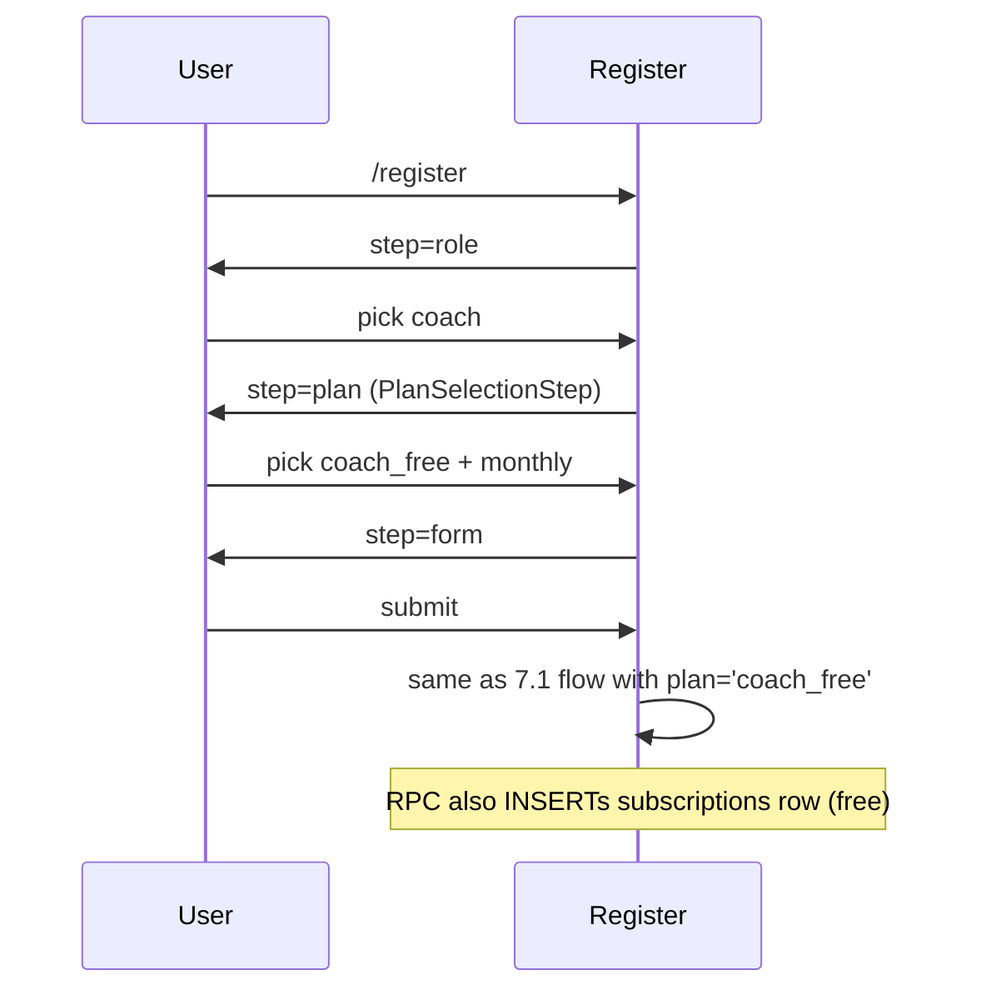
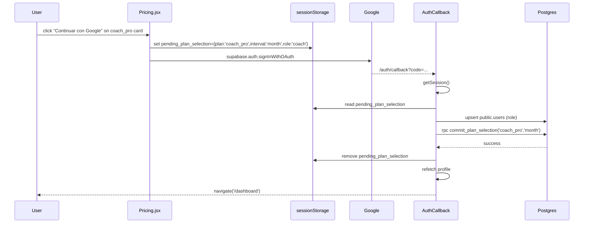
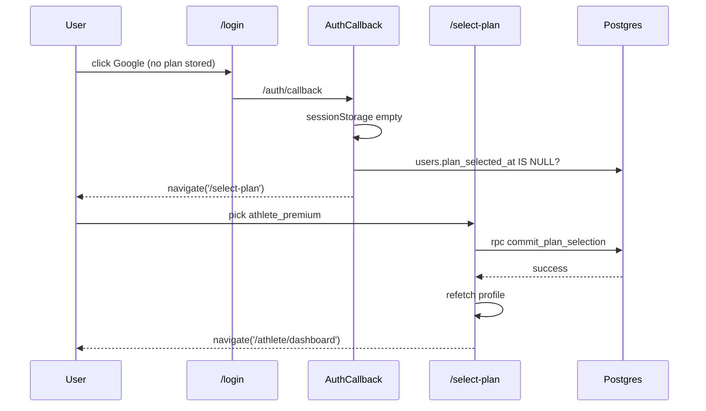
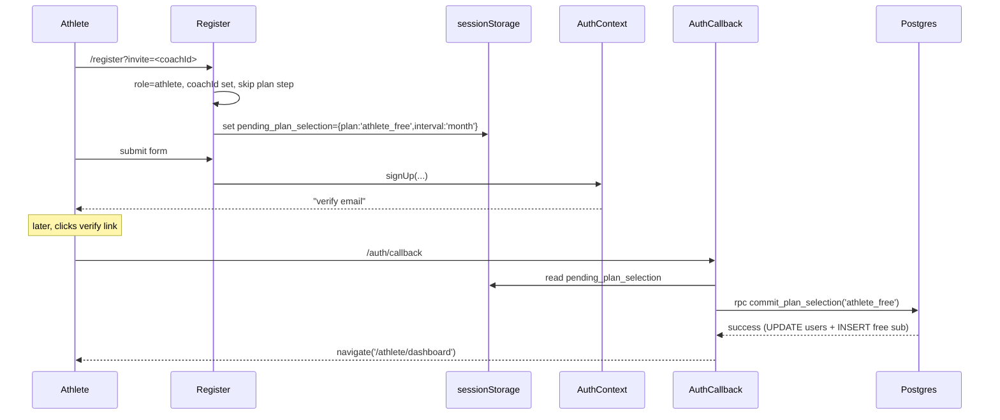
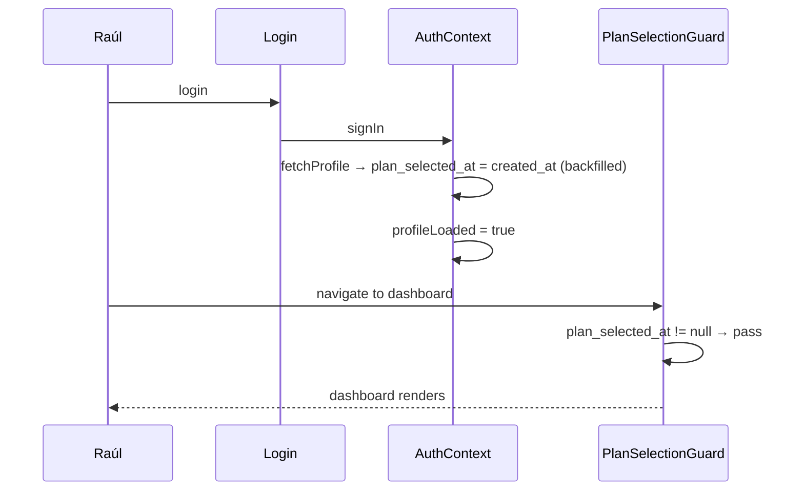

# Design: Plan Selection Required on Registration

## 1. Architecture Overview

```
                  ┌─────────────────────────────────────────────┐
                  │            ENTRY POINTS                      │
                  └─────────────────────────────────────────────┘
                               │
  ┌────────────────────────────┼────────────────────────────────┐
  │                            │                                │
  ▼                            ▼                                ▼
EMAIL/PWD              GOOGLE OAUTH                      COACHED ATHLETE
(Register wizard)   (from /pricing or /login)            (?invite=<coachId>)
  │                            │                                │
  │  [Step 1: Role]            │                                │
  │  [Step 1.5: Plan*]         │ sessionStorage.set(            │
  │  [Step 2: Form]            │   'pending_plan_selection')    │
  │                            │                                │
  │ supabase.auth.signUp       │ supabase.auth                  │ supabase.auth.signUp
  │ (metadata.role+plan)       │   .signInWithOAuth             │ (metadata.role, coachId)
  │                            │                                │
  │  handle_new_user trigger   │  AuthCallback reads            │
  │  creates public.users      │  sessionStorage                │
  │                            │                                │
  ▼                            ▼                                ▼
RPC: commit_plan_selection(p_plan_key, p_billing_interval)
  │                            │                                │
  │  SECURITY DEFINER          │                                │ auto-call with
  │  - validates plan_key      │                                │ plan_key='athlete_free'
  │  - UPDATE users SET        │                                │
  │      plan_selected_at=now  │                                │
  │      selected_plan=X       │                                │
  │  - if free: INSERT         │                                │
  │      subscriptions row     │                                │
  ▼                            ▼                                ▼
                        Dashboard (guard passes)
```

*Plan step skipped when `?plan=` in URL OR role is coached athlete.

**Fallback**: Google user with no `pending_plan_selection` AND `plan_selected_at IS NULL` → `PlanSelectionGuard` redirects to `/select-plan`. That page calls the same RPC.

**Server is single writer**: All writes to `users.plan_selected_at` and `users.selected_plan` go through `commit_plan_selection` RPC. Clients cannot write these columns directly (enforced by trigger).

---

## 2. Data Model Changes

### `users` table — new columns

| Column | Type | Nullable | Notes |
|--------|------|----------|-------|
| `plan_selected_at` | `timestamptz` | YES | NULL = hasn't committed a plan; triggers `/select-plan` guard |
| `selected_plan` | `text` | YES | Chosen plan key; CHECK against whitelist from `planFeatures.js` |

**Index**: partial index on `id WHERE plan_selected_at IS NULL` — the hot path is "is this user unblocked?" and the null set shrinks to zero once users commit.

### `subscriptions` table — verify nullability

Exploration confirmed via `stripe-webhook/index.ts` upsert that columns exist. Must verify the following are **nullable** so the free-plan RPC insert (`stripe_*` fields all NULL) succeeds:

- `stripe_customer_id`, `stripe_subscription_id`, `stripe_price_id`
- `current_period_start`, `current_period_end`
- `billing_interval`

**Verification query** (run before migration):
```sql
SELECT column_name, is_nullable
FROM information_schema.columns
WHERE table_schema='public' AND table_name='subscriptions'
  AND column_name IN ('stripe_customer_id','stripe_subscription_id',
                      'stripe_price_id','current_period_start',
                      'current_period_end','billing_interval');
```
If any row returns `NO`, add `ALTER TABLE ... DROP NOT NULL` statements inside the migration transaction.

---

## 3. Migration SQL

### UP (single atomic transaction)

```sql
BEGIN;

-- 1. Columns
ALTER TABLE public.users
  ADD COLUMN plan_selected_at timestamptz,
  ADD COLUMN selected_plan    text;

-- 2. Whitelist constraint (mirrors PLAN_FEATURES keys)
ALTER TABLE public.users
  ADD CONSTRAINT users_selected_plan_check
  CHECK (
    selected_plan IS NULL OR selected_plan IN (
      'coach_free','coach_pro','coach_team',
      'athlete_free','athlete_premium'
    )
  );

-- 3. Grandfather existing users (same tx as column add → zero window)
UPDATE public.users
SET    plan_selected_at = created_at
WHERE  plan_selected_at IS NULL;

-- 4. Guard on subscriptions nullability
--    Uncomment after running the verification query above.
-- ALTER TABLE public.subscriptions
--   ALTER COLUMN stripe_customer_id    DROP NOT NULL,
--   ALTER COLUMN stripe_subscription_id DROP NOT NULL,
--   ALTER COLUMN stripe_price_id        DROP NOT NULL,
--   ALTER COLUMN current_period_start   DROP NOT NULL,
--   ALTER COLUMN current_period_end     DROP NOT NULL,
--   ALTER COLUMN billing_interval       DROP NOT NULL;

-- 5. Hot-path index (partial — only null rows)
CREATE INDEX IF NOT EXISTS idx_users_plan_selected_at_null
  ON public.users (id)
  WHERE plan_selected_at IS NULL;

-- 6. Trigger blocking direct client writes (see section 5)
CREATE OR REPLACE FUNCTION public.users_block_plan_cols()
RETURNS trigger LANGUAGE plpgsql AS $$
BEGIN
  IF current_setting('request.jwt.claims', true)::jsonb->>'role' = 'service_role' THEN
    RETURN NEW;
  END IF;
  IF OLD.plan_selected_at IS DISTINCT FROM NEW.plan_selected_at
     OR OLD.selected_plan IS DISTINCT FROM NEW.selected_plan THEN
    RAISE EXCEPTION 'plan_selection_readonly';
  END IF;
  RETURN NEW;
END $$;

CREATE TRIGGER users_block_plan_cols_trg
BEFORE UPDATE ON public.users
FOR EACH ROW EXECUTE FUNCTION public.users_block_plan_cols();

COMMIT;
```

The RPC uses `SECURITY DEFINER` and runs as the table owner, bypassing the trigger's JWT-role check via `SET LOCAL role` if needed, or the trigger can be replaced with a simpler check of `session_user`. Simpler: make the trigger allow writes when `current_user = 'postgres'` (which is the case inside SECURITY DEFINER).

### DOWN migration

```sql
BEGIN;
DROP TRIGGER  IF EXISTS users_block_plan_cols_trg ON public.users;
DROP FUNCTION IF EXISTS public.users_block_plan_cols();
DROP INDEX    IF EXISTS public.idx_users_plan_selected_at_null;
ALTER TABLE public.users
  DROP CONSTRAINT IF EXISTS users_selected_plan_check,
  DROP COLUMN     IF EXISTS selected_plan,
  DROP COLUMN     IF EXISTS plan_selected_at;
-- Subscriptions NOT NULL changes (if applied in UP) are left nullable.
-- Free-plan subscription rows created during feature window are benign.
COMMIT;
```

---

## 4. Server-Side Commit: `commit_plan_selection` RPC

**Decision (ADR 1):** Postgres RPC with `SECURITY DEFINER`. Rationale: atomic (UPDATE users + INSERT subscriptions in one transaction), no cold start, simpler than Edge Function. Can be wrapped by an Edge Function later if we need analytics/webhooks.

```sql
CREATE OR REPLACE FUNCTION public.commit_plan_selection(
  p_plan_key         text,
  p_billing_interval text DEFAULT 'month'
) RETURNS json
LANGUAGE plpgsql
SECURITY DEFINER
SET search_path = public
AS $$
DECLARE
  v_user_id uuid := auth.uid();
  v_role    text;
BEGIN
  IF v_user_id IS NULL THEN
    RAISE EXCEPTION 'unauthorized' USING ERRCODE = '28000';
  END IF;

  IF p_plan_key NOT IN (
    'coach_free','coach_pro','coach_team',
    'athlete_free','athlete_premium'
  ) THEN
    RAISE EXCEPTION 'invalid_plan_key' USING ERRCODE = '22023';
  END IF;

  IF p_billing_interval NOT IN ('month','year') THEN
    RAISE EXCEPTION 'invalid_billing_interval' USING ERRCODE = '22023';
  END IF;

  -- Idempotency guard: allow only if plan_selected_at IS NULL
  IF EXISTS (
    SELECT 1 FROM users
    WHERE id = v_user_id AND plan_selected_at IS NOT NULL
  ) THEN
    RAISE EXCEPTION 'plan_already_selected' USING ERRCODE = '23505';
  END IF;

  -- Role / plan_key cross-validation
  SELECT role INTO v_role FROM users WHERE id = v_user_id;
  IF v_role = 'coach'   AND p_plan_key NOT LIKE 'coach_%'   THEN
    RAISE EXCEPTION 'plan_role_mismatch' USING ERRCODE = '22023';
  END IF;
  IF v_role IN ('athlete','independent_athlete')
     AND p_plan_key NOT LIKE 'athlete_%' THEN
    RAISE EXCEPTION 'plan_role_mismatch' USING ERRCODE = '22023';
  END IF;

  -- Commit selection on users
  UPDATE users
     SET plan_selected_at = now(),
         selected_plan    = p_plan_key
   WHERE id = v_user_id;

  -- Free plans get a real subscriptions row
  IF p_plan_key IN ('coach_free','athlete_free') THEN
    INSERT INTO subscriptions (
      user_id, plan_key, status, billing_interval,
      stripe_customer_id, stripe_subscription_id,
      stripe_price_id, current_period_start, current_period_end
    )
    VALUES (
      v_user_id, p_plan_key, 'active', p_billing_interval,
      NULL, NULL, NULL, NULL, NULL
    )
    ON CONFLICT (user_id) DO NOTHING;
  END IF;

  RETURN json_build_object(
    'success',  true,
    'plan_key', p_plan_key,
    'committed_at', now()
  );
END;
$$;

REVOKE ALL    ON FUNCTION public.commit_plan_selection(text, text) FROM public;
GRANT  EXECUTE ON FUNCTION public.commit_plan_selection(text, text) TO authenticated;
```

**Error taxonomy** (surfaced to frontend for i18n messages):

| Error | Meaning | UX |
|-------|---------|----|
| `unauthorized` | No JWT | Navigate to `/login` |
| `invalid_plan_key` | Not in whitelist | Toast "Plan no válido" |
| `invalid_billing_interval` | Not month/year | Toast "Intervalo inválido" |
| `plan_already_selected` | Idempotency block | Silently refetch profile, redirect to dashboard |
| `plan_role_mismatch` | coach chose athlete_* or vice versa | Toast "Plan no compatible con tu rol" |

---

## 5. RLS & Trigger Updates

**Option chosen (ADR 2): BEFORE UPDATE trigger `users_block_plan_cols`** (see migration section 3). Rationale: column-level `REVOKE UPDATE (col)` exists in Postgres but interacts badly with Supabase's `authenticated` role and existing bulk policies. The trigger is explicit, testable, and raises a descriptive error. SECURITY DEFINER RPC runs as the function owner (superuser-ish) and passes a check in the trigger for `session_user` or we set `SET LOCAL role postgres` — simpler: make trigger check `current_user = 'postgres'` (the owner), which holds inside SECURITY DEFINER.

**`subscriptions` RLS**: already has `sub_select_own` (user reads own) and `sub_service_all` (service role full). The RPC runs as SECURITY DEFINER (owner), bypassing RLS. No new policies needed.

---

## 6. Frontend Architecture

### File-by-file changes

| File | Action | Change |
|------|--------|--------|
| `src/hooks/useRegisterForm.js` | Modify | Read `?plan=` and `?interval=`. Add `plan`/`billingInterval` to state. New `step = 'plan'` between `role` and `form`, shown only when plan not in URL AND role is not coached-athlete. Carry through to `signUp`. |
| `src/pages/Register.jsx` | Modify | Render `<PlanSelectionStep>` when `step === 'plan'`. |
| `src/components/register/PlanSelectionStep.jsx` | **NEW** | Receives `role`, `value`, `onChange`, `onNext`. Renders Free/Pro/Team (coach) or Free/Premium (athlete) cards. Pure presentation. |
| `src/pages/SelectPlan.jsx` | **NEW** | Full-page blocker for authenticated `plan_selected_at IS NULL` users. Uses `<PlanSelectionStep>`. On submit → `subscriptionService.commitPlanSelection(planKey, interval)` → refresh profile → `navigate` by role. |
| `src/components/common/PlanSelectionGuard.jsx` | **NEW** | Wrapper: if `!profileLoaded` → render children (wait). If `profile.is_admin` → render. If `profile.plan_selected_at == null` → `<Navigate to="/select-plan" replace />`. Else render. |
| `src/contexts/AuthContext.jsx` | Modify | Add `profileLoaded` boolean (false until `fetchProfile` resolves). `fetchProfile` must select `plan_selected_at, selected_plan`. `signInWithGoogle(metadata, pendingPlan?)` writes `pending_plan_selection` JSON `{plan_key, billing_interval, role}` to **sessionStorage** before `signInWithOAuth`. |
| `src/pages/AuthCallback.jsx` | Modify | After session confirmed: if `pending_plan_selection` in sessionStorage AND user's `plan_selected_at` is null → call RPC, clear key, refetch profile, redirect by role. Otherwise: if `plan_selected_at` is null → `/select-plan`; else redirect. Must NOT navigate until commit resolves (prevents guard race). |
| `src/components/landing/Pricing.jsx` | Modify | For the "Continuar con Google" CTA path (if exists): write sessionStorage before OAuth. Existing `/register?plan=...` path is unchanged. |
| `src/layouts/DashboardLayout.jsx` | Modify | Wrap `<SubscriptionGuard><Outlet/></SubscriptionGuard>` inside `<PlanSelectionGuard>`. |
| `src/layouts/AthleteDashboardLayout.jsx` | Modify | Same wrapping. |
| `src/App.jsx` | Modify | Lazy import `SelectPlan`; add `<Route path="/select-plan" element={<SelectPlan />} />` (no dashboard layout). |
| `src/services/subscriptionService.js` | Modify | Add `commitPlanSelection(planKey, billingInterval='month')` → `supabase.rpc('commit_plan_selection', { p_plan_key, p_billing_interval })`. Map error messages. |

### Coached athlete auto-commit

In `useRegisterForm.js`, detect coached path (`coachId` from invite OR non-empty `coachEmail`). After `signUp` resolves successfully **and session exists** (email+password auto-login flow), call `commitPlanSelection('athlete_free', 'month')` before navigation. If the user must verify email first (no immediate session), defer: `AuthCallback.jsx` will hit the same path on first login — the guard will redirect to `/select-plan` in that window unless we set a sessionStorage hint `pending_plan_selection={plan_key:'athlete_free'}` BEFORE `supabase.auth.signUp`. Simpler: always write that sessionStorage hint for coached athletes so the post-verify login auto-commits.

### AuthContext `profileLoaded` contract

```js
const [profileLoaded, setProfileLoaded] = useState(false);
// inside onAuthStateChange → after fetchProfile resolves (success or catch):
setProfileLoaded(true);
// on SIGNED_OUT:
setProfileLoaded(false);
```

Exposed in context value; consumed by `PlanSelectionGuard`. The existing `loading` flag is preserved for backwards compat.

---

## 7. Sequence Diagrams

### 7.1 Email/password with `?plan=` in URL

```mermaid
sequenceDiagram
  participant U as User
  participant R as Register.jsx
  participant A as AuthContext
  participant S as Supabase Auth
  participant DB as Postgres
  U->>R: /register?plan=coach_pro&interval=month
  R->>R: skip plan step, carry plan
  U->>R: fill form, submit
  R->>A: signUp(email, pwd, role, plan='coach_pro')
  A->>S: supabase.auth.signUp
  S->>DB: handle_new_user trigger → users row
  S-->>A: session (or email-verify required)
  A->>DB: rpc commit_plan_selection('coach_pro','month')
  DB-->>A: success (UPDATE users; NO subscriptions row — paid)
  A->>A: fetchProfile → profileLoaded=true
  A-->>R: navigate('/dashboard')
```

### 7.2 Email/password without `?plan=` (wizard step)



### 7.3 Google OAuth from `/pricing`



### 7.4 Google OAuth direct (no sessionStorage → fallback)



### 7.5 Coached athlete via invite link



### 7.6 Existing user login (grandfathered)



---

## 8. Testing Strategy

No test framework in this project — **manual test checklist**:

### Core flows
- [ ] `/register?plan=coach_pro` → skip plan step → signup → dashboard (no sub row, `selected_plan='coach_pro'`)
- [ ] `/register` wizard → role=coach → plan step visible → pick Free → dashboard (`subscriptions` row exists, `plan_key='coach_free'`)
- [ ] `/register` wizard → role=athlete (independent) → plan step → pick Premium → `selected_plan='athlete_premium'`
- [ ] Google OAuth from `/pricing` card → sessionStorage hand-off → dashboard with plan committed
- [ ] Google OAuth from `/login` with empty sessionStorage → `/select-plan` → pick plan → dashboard
- [ ] `/register?invite=<coachId>` → no plan step → email verify → `AuthCallback` auto-commits `athlete_free` → dashboard

### Edge cases
- [ ] **Flash-redirect**: hard-refresh on `/dashboard` as existing user — guard must NOT flash to `/select-plan` while `profileLoaded=false`
- [ ] **sessionStorage race**: close tab between pricing click and OAuth return → falls back to `/select-plan` (sessionStorage lost with tab)
- [ ] **Multi-tab**: tab A on `/select-plan`, tab B on `/select-plan`. Commit in A → B will hit `plan_already_selected` on submit → should silently refetch and navigate
- [ ] **Grandfather**: existing users (Raúl, coach@test.com) never hit `/select-plan`
- [ ] **Plan/role mismatch**: manipulate frontend to send `athlete_free` as coach → RPC rejects `plan_role_mismatch`
- [ ] **Invalid plan**: send `coach_ultra` → RPC rejects `invalid_plan_key`
- [ ] **Idempotency**: call RPC twice → second call returns `plan_already_selected`
- [ ] **Admin**: admin login → dashboard renders without hitting guard
- [ ] **Direct UPDATE bypass**: as authenticated user, try `UPDATE users SET plan_selected_at=now()` → trigger blocks with `plan_selection_readonly`
- [ ] **Free plan admin view**: new free user shows `Coach Free` + `Activa` in `/admin/users/<id>` (not "Sin suscripción")
- [ ] **Paid plan admin view**: new paid-picker shows `selected_plan='coach_pro'` but "Sin suscripción" until Stripe webhook fires (expected)

---

## 9. Deployment Order

1. **Pre-check** the subscriptions nullability query in DB (section 2). Amend migration if needed.
2. **Apply migration** (adds columns + grandfathers + trigger + RPC in one transaction). Verify:
   - `SELECT COUNT(*) FROM users WHERE plan_selected_at IS NULL;` → 0
   - `\df commit_plan_selection` lists the function
3. **Deploy frontend** with guards, PlanSelectionStep, SelectPlan page, AuthContext changes.
4. **Smoke test** on production:
   - Log in as existing user → no `/select-plan` redirect
   - New email signup with `?plan=coach_free` → row appears in `subscriptions`
   - New Google signup from `/pricing` → row appears
5. **Monitor** for 48h:
   - `SELECT COUNT(*) FROM users WHERE plan_selected_at IS NULL AND created_at > '<deploy-ts>'` should stay at 0
   - Supabase logs for `plan_selection_readonly` / `invalid_plan_key` exceptions

Rollback: DOWN migration + revert frontend deploy.

---

## 10. Architecture Decisions Log

| ADR | Decision | Rationale |
|-----|----------|-----------|
| **1** | RPC (`SECURITY DEFINER`) over Edge Function for plan commit | Atomic UPDATE + INSERT in one tx. No cold start. Simpler than a Deno function. Wrap in Edge Function later if analytics/webhooks needed. |
| **2** | BEFORE UPDATE trigger (`users_block_plan_cols`) over column-level GRANT or RLS `OLD=NEW` check | Explicit, testable, raises named error `plan_selection_readonly`. Column-level REVOKE interacts poorly with Supabase's `authenticated` role semantics. |
| **3** | `sessionStorage` (not `localStorage`) for Google OAuth plan hand-off | Tab-scoped, auto-clears on tab close, avoids cross-tab pollution. Matches locked decision #6. The existing `google_oauth_metadata` localStorage stays for role/coach data; plan lives in its own sessionStorage key. |
| **4** | Grandfather existing users inside the same migration transaction | Zero-downtime: `ALTER TABLE ADD COLUMN` + `UPDATE` run atomically, so no request ever sees NULL `plan_selected_at` on an existing user. |
| **5** | Free plan → `subscriptions` row, paid plan → only `users.selected_plan` | Simplifies `useSubscription`: an `active` sub row means effective plan = plan_key. For paid pickers, `isTrialing` (via `trial_ends_at`) grants Premium until Stripe webhook writes the real row. Avoids "stale paid row, never paid" ambiguity. |
| **6** | Partial index `WHERE plan_selected_at IS NULL` | Hot-path query for the guard is always `id = ? AND plan_selected_at IS NULL`. Partial index shrinks to zero after full adoption, costs nothing once empty. |
| **7** | Single `commit_plan_selection` RPC handles all four flows | One place for validation, one place for audit. Client always calls the same function. Reduces branching and drift. |

---

## Open Questions

- [ ] Should free plan still get `trial_ends_at = now() + 14 days` (proposal decision #3 says YES) or should the trigger skip it for free users? **Decision for apply phase**: keep the trigger as-is; `useSubscription` already subordinates trial to an active subscription row, so free users with a sub row will see Free features immediately. Paid pickers without a sub row will see Premium during trial. Matches locked decisions.
- [ ] Feature flag for safe rollout? **Recommendation**: no feature flag. The grandfather backfill means existing users are unaffected, and the change is self-contained. Deploy migration first, then frontend. Rollback via DOWN migration if issues.
